# Cost Calculation Algorithms

This document describes the algorithms Lumina uses to calculate per-instance costs, including how AWS Savings Plans and Reserved Instances are allocated. It also documents known limitations and differences from AWS's actual billing.

## Table of Contents

- [Overview](#overview)
- [Priority Order](#priority-order)
- [Reserved Instances Algorithm](#reserved-instances-algorithm)
- [Savings Plans Algorithm](#savings-plans-algorithm)
- [Simplified Model Decisions](#simplified-model-decisions)
- [Known Limitations](#known-limitations)
- [Metrics and Invariants](#metrics-and-invariants)
- [Future Improvements](#future-improvements)

## Overview

Lumina replicates AWS's cost allocation algorithm to estimate how Savings Plans (SPs) and Reserved Instances (RIs) are applied to running EC2 instances. The goal is to provide **real-time cost visibility** for Kubernetes capacity management, not to replicate AWS billing exactly.

**AWS Documentation References:**
- [How Savings Plans apply to usage](https://docs.aws.amazon.com/savingsplans/latest/userguide/sp-applying.html)
- [How Reserved Instances are applied](https://docs.aws.amazon.com/AWSEC2/latest/UserGuide/apply_ri.html)
- [EC2 On-Demand Pricing](https://aws.amazon.com/ec2/pricing/on-demand/)

### Key Concepts

**Rate-Based vs Cumulative:**
- Lumina uses an **instantaneous rate-based model** ($/hour snapshot)
- AWS billing uses **cumulative tracking within each billing hour** ([AWS Billing documentation](https://docs.aws.amazon.com/awsaccountbilling/latest/aboutv2/con-bill-blended-rates.html))
- This means Lumina's costs are estimates based on "if current instances keep running"

**ShelfPrice vs EffectiveCost:**
- **ShelfPrice**: On-demand rate with no discounts (e.g., $1.00/hr for m5.xlarge) ([AWS On-Demand Pricing](https://aws.amazon.com/ec2/pricing/on-demand/))
- **EffectiveCost**: Actual estimated cost after all discounts (e.g., $0.34/hr with SP)

## Priority Order

AWS applies discounts in strict priority order ([AWS Savings Plans application order](https://docs.aws.amazon.com/savingsplans/latest/userguide/sp-applying.html#applying-order)):

1. **Spot Pricing** - Spot instances always pay spot market rate (no RIs/SPs apply)
2. **Reserved Instances (RIs)** - Applied first to exact instance type + AZ matches
3. **EC2 Instance Savings Plans** - Applied to specific instance family + region
4. **Compute Savings Plans** - Applied to any instance family, any region
5. **On-Demand** - Remaining uncovered usage pays full on-demand rates

**Lumina implements all of these priorities correctly.**


## Reserved Instances Algorithm

**AWS Documentation:** [How Reserved Instances are applied](https://docs.aws.amazon.com/AWSEC2/latest/UserGuide/apply_ri.html)

### Matching Rules

Reserved Instances match based on ([AWS RI Matching Rules](https://docs.aws.amazon.com/AWSEC2/latest/UserGuide/reserved-instances-fundamentals.html)):
- **Instance Type**: Exact match (e.g., RI for m5.xlarge only covers m5.xlarge)
- **Availability Zone**: Exact match (e.g., RI in us-west-2a only covers us-west-2a)
- **Account**: RIs only apply within the same AWS account
- **Lifecycle**: RIs do NOT apply to spot instances

### Allocation Algorithm

```
1. Group RIs by (instance_type, availability_zone, account_id)
2. For each group:
   a. Find all matching running instances (not spot)
   b. Sort instances by launch time (oldest first)
   c. Apply RI coverage to oldest instances until RI count exhausted
3. Mark covered instances:
   - EffectiveCost = $0 (RIs are pre-paid)
   - RICoverage = ShelfPrice (what the RI contributed)
   - CoverageType = "reserved_instance"
```

**RI coverage is binary**: An instance is either fully RI-covered or not covered at all.


### Example

**Scenario:** 5 RIs for m5.xlarge in us-west-2a, 10 running instances


**Result:**
- **5 oldest instances**: RI-covered (EffectiveCost = $0)
- **5 newest instances**: Not RI-covered (eligible for SP coverage next)

## Savings Plans Algorithm

**AWS Documentation:** [How Savings Plans apply to your AWS usage](https://docs.aws.amazon.com/savingsplans/latest/userguide/sp-applying.html)

### SP Types

**EC2 Instance Savings Plans** ([AWS EC2 Instance SP docs](https://docs.aws.amazon.com/savingsplans/latest/userguide/sp-types.html#sp-ec2-instance)):
- Apply to specific instance family (e.g., "m5") in specific region (e.g., "us-west-2")
- Provide ~72% discount (configurable in code)
- Higher priority than Compute SPs
- Example: SP for "m5 in us-west-2" covers m5.large, m5.xlarge, m5.2xlarge, etc.

**Compute Savings Plans** ([AWS Compute SP docs](https://docs.aws.amazon.com/savingsplans/latest/userguide/sp-types.html#sp-compute)):
- Apply to ANY instance family in ANY region
- Provide ~66% discount (configurable in code)
- Lower priority than EC2 Instance SPs
- Example: SP covers m5, c5, r5, across all regions

### Matching Rules

Savings Plans match based on ([AWS SP application rules](https://docs.aws.amazon.com/savingsplans/latest/userguide/sp-applying.html#applying-sp)):
- **Instance Family**: EC2 Instance SPs require matching family; Compute SPs match all
- **Region**: EC2 Instance SPs require matching region; Compute SPs match all regions
- **Account**: SPs apply within the same AWS account
- **Lifecycle**: SPs do NOT apply to spot instances
- **Existing Coverage**: See [Simplified Model](#simplified-model-decisions)

### Allocation Algorithm

For each Savings Plan (in priority order: EC2 Instance SPs first, then Compute SPs):

```
1. Find all eligible instances:
   - Match SP criteria (family, region)
   - Not spot instances
   - Not already RI-covered
   - Not already SP-covered (simplified model)

2. Calculate savings for each instance:
   - ShelfPrice (on-demand rate)
   - SP Rate (discounted rate)
   - Savings % = (ShelfPrice - SP Rate) / ShelfPrice

3. Sort instances by priority:
   a. Highest savings % first (maximize cost reduction) - AWS behavior
   b. Tie-breaker: lowest SP rate first (stretch commitment further) - AWS behavior
   c. Tie-breaker: oldest launch time (stability) - **Lumina-specific for stable metrics**
   d. Tie-breaker: instance ID (determinism) - **Lumina-specific for stable metrics**

   **Note:** Tie-breakers (c) and (d) are Lumina's own decisions, not AWS's documented behavior.
   We use launch time and instance ID to ensure that SP allocation remains consistent across
   reconciliation loops (every 5 minutes). Without these tie-breakers, instances with identical
   savings percentages could receive different SP coverage on each calculation cycle, causing
   metrics to fluctuate unnecessarily.

4. Apply SP coverage in priority order:
   For each instance:
     a. Calculate SP contribution = min(SP rate, remaining commitment)
     b. If commitment exhausted (partial coverage):
        - SP contributes what's left
        - Instance pays: (ShelfPrice - SP contribution) at on-demand rate
     c. Update instance:
        - EffectiveCost = SP rate (if full coverage) OR on-demand spillover (if partial)
        - SavingsPlanCoverage = SP contribution (what SP paid)
        - CoverageType = "compute_savings_plan" or "ec2_instance_savings_plan"
     d. Consume SP commitment

5. Track SP utilization:
   - CurrentUtilizationRate = commitment consumed
   - RemainingCapacity = commitment - utilization
   - UtilizationPercent = (utilization / commitment) * 100
```

### Full vs Partial Coverage

#### Scenario 1: Full Coverage ✅

**Setup:** Instance needs $0.34/hr, SP has $60.00/hr remaining (plenty!)

```mermaid
flowchart LR
    I1["m5.xlarge<br/>ShelfPrice: $1.00<br/>SP Rate: $0.34"]
    SP1["Savings Plan<br/>$60.00 available"]
    Result["Final Cost<br/>$0.34/hr"]

    I1 -->|"Needs $0.34"| SP1
    SP1 -->|"✅ Fully covers"| Result

    style I1 fill:#fff,stroke:#1976d2,stroke-width:3px,color:#000
    style SP1 fill:#fff,stroke:#2e7d32,stroke-width:3px,color:#000
    style Result fill:#c8e6c9,stroke:#2e7d32,stroke-width:4px,color:#000
```



**Result:**
- ✅ SP contributes: **$0.34** (full SP rate)
- ✅ Instance pays: **$0.34** (fully discounted)
- ✅ SP remaining: **$59.66** (plenty left)
- ✅ No on-demand spillover

---

#### Scenario 2: Partial Coverage ⚠️ (SP Exhaustion)

**Setup:** Instance needs $0.34/hr, but SP only has $0.10/hr remaining (not enough!)

```mermaid
flowchart LR
    I2["m5.xlarge<br/>ShelfPrice: $1.00<br/>SP Rate: $0.34"]
    SP2["Savings Plan<br/>⚠️ Only $0.10 left"]
    Result2["Final Cost<br/>$0.90/hr<br/>$0.10 SP + $0.80 OD"]

    I2 -->|"Needs $0.34"| SP2
    SP2 -->|"⚠️ Partial only"| Result2

    style I2 fill:#fff,stroke:#1976d2,stroke-width:3px,color:#000
    style SP2 fill:#fff,stroke:#d32f2f,stroke-width:3px,color:#000
    style Result2 fill:#ffe0b2,stroke:#e65100,stroke-width:4px,color:#000
```



**Result:**
- ⚠️ SP contributes: **$0.10** (all it has left)
- ⚠️ Instance pays: **$0.90** = $0.10 (from SP) + **$0.80 (on-demand spillover)**
- 🚫 SP remaining: **$0.00** (exhausted)
- 🔴 On-demand spillover: **$0.80**

**Key insight:** The `EffectiveCost` metric ($0.90) is **higher** than the SP contribution ($0.10) because it includes on-demand spillover. This is why:

```
sum(ec2_instance_hourly_cost) ≥ sum(savings_plan_current_utilization_rate)
```

The difference represents **real on-demand costs** from partial coverage.

### Example: Large-Scale SP Allocation

**Scenario:** $60/hr Compute SP commitment, 66% discount, 200 m5.xlarge instances ($1.00 OD, $0.34 SP rate)


**Allocation breakdown:**
1. **Sort instances** by savings priority (highest % first)
2. **Cover first 176 instances fully**: 176 × $0.34 = $59.84 consumed
3. **Instance #177 gets partial coverage**:
   - SP contributes: $0.16 (all that's left)
   - On-demand spillover: $0.84 (remainder at OD rate)
   - **EffectiveCost: $1.00** (what instance pays: $0.16 SP + $0.84 OD)
4. **Remaining 23 instances**: On-demand ($1.00 each, no SP coverage)

**SP Metrics:**
- Commitment: $60.00/hr
- Utilization: $60.00/hr (100%)
- Remaining: $0.00/hr

**Instance Cost Metrics:**
- Instances 1-176: `ec2_instance_hourly_cost{cost_type="compute_savings_plan"} = 0.34` × 176 = **$59.84** (fully covered)
- Instance 177: `ec2_instance_hourly_cost{cost_type="compute_savings_plan"} = 1.00` (**EffectiveCost includes $0.84 OD spillover!**)
- Instances 178-200: `ec2_instance_hourly_cost{cost_type="on_demand"} = 1.00` × 23 = **$23.00** (no SP coverage)

**Total instance costs: $59.84 + $1.00 + $23.00 = $83.84/hr**

**Critical observation:** The SP-covered instance costs (**$59.84 + $1.00 = $60.84**) exceed SP utilization (**$60.00**) by **$0.84**, which is the on-demand spillover from instance #177's partial coverage.

---

## Real-World Test Scenarios

The examples in this document are based on **actual test scenarios** with simple, easy-to-understand pricing. These tests validate that Lumina's cost calculations work correctly and match the documented algorithms.

**Test Location:** [`pkg/cost/calculator_comprehensive_test.go`](../pkg/cost/calculator_comprehensive_test.go)
**Test Function:** `TestCalculatorComprehensiveScenarios`

### Test Pricing Scheme

All test scenarios use consistent, simple pricing to make the math easy to follow:

| Instance Type | On-Demand | Compute SP (66% discount) | Spot Market |
|--------------|-----------|---------------------------|-------------|
| m5.2xlarge   | $2.00/hr  | $0.68/hr                  | N/A         |
| m5.xlarge    | $1.00/hr  | $0.34/hr                  | $0.50/hr    |
| c5.xlarge    | $1.00/hr  | $0.34/hr                  | $0.40/hr    |
| t3.medium    | $0.50/hr  | $0.17/hr                  | $0.20/hr    |

**Note:** EC2 Instance Savings Plans provide 72% discount (higher than Compute SP's 66%).

### Scenario 1: RI Coverage Only

**Test:** [`calculator_comprehensive_test.go:68-120`](../pkg/cost/calculator_comprehensive_test.go#L68-L120)
**Description:** 5 RIs for m5.2xlarge, 15 m5.2xlarge instances running

**Setup:**
- **Reserved Instances:** 5 RIs for m5.2xlarge in us-west-2a
- **Instances:** 15 m5.2xlarge instances (all on-demand lifecycle)
- **Savings Plans:** None

**Expected Results:**
- **First 5 instances (oldest):** RI-covered
  - EffectiveCost: $0.00 (RIs are pre-paid)
  - RICoverage: $2.00 (what RI contributed)
  - CoverageType: `reserved_instance`
- **Last 10 instances:** On-demand
  - EffectiveCost: $2.00 (full on-demand rate)
  - CoverageType: `on_demand`

**Totals:**
- ShelfPrice: $30.00/hr (15 × $2.00)
- EffectiveCost: $20.00/hr (10 × $2.00, since 5 are RI-covered)
- Savings: $10.00/hr (5 × $2.00 from RI coverage)

**Key Validation:** Oldest 5 instances get RI coverage (by launch time), newest 10 pay on-demand.

### Scenario 2: RI + SP Coverage

**Test:** [`calculator_comprehensive_test.go:122-208`](../pkg/cost/calculator_comprehensive_test.go#L122-L208)
**Description:** 5 RIs, 1 Compute SP with $3.00/hr commitment, 15 total instances

**Setup:**
- **Reserved Instances:** 5 RIs for m5.2xlarge in us-west-2a
- **Instances:** 15 m5.xlarge instances (mixed on-demand and spot)
- **Savings Plans:** 1 Compute SP with $3.00/hr commitment (66% discount → $0.34 SP rate for m5.xlarge)

**Expected Results:**
- **First 5 instances:** RI-covered (EffectiveCost: $0.00)
- **Next ~8.8 instances:** SP-covered
  - $3.00 commitment ÷ $0.34 SP rate = ~8.8 instances
  - Last instance gets partial coverage (SP exhaustion + on-demand spillover)
- **Remaining instances:** On-demand (EffectiveCost: $1.00)

**Key Validation:**
- RI coverage applied first (priority)
- SP coverage applied to remaining instances
- One instance shows partial SP coverage with on-demand spillover
- Spot instances pay spot rate (no RI/SP coverage)

### Scenario 3: Spot Instances Don't Get RI/SP Coverage

**Test:** [`calculator_comprehensive_test.go:210-279`](../pkg/cost/calculator_comprehensive_test.go#L210-L279)
**Description:** Validates that spot instances NEVER get RI or SP coverage

**Setup:**
- **Reserved Instances:** 5 RIs for m5.2xlarge in us-west-2a
- **Instances:**
  - 10 m5.2xlarge on-demand
  - 10 m5.xlarge spot
- **Savings Plans:** None

**Expected Results:**
- **First 5 m5.2xlarge on-demand:** RI-covered (EffectiveCost: $0.00)
- **Next 5 m5.2xlarge on-demand:** On-demand (EffectiveCost: $2.00)
- **All 10 m5.xlarge spot:** Spot rate (EffectiveCost: $0.50)
  - **CRITICAL:** Spot instances do NOT get RI coverage even though:
    - RIs exist for m5 family
    - RIs are in same AZ
  - Spot always pays spot market rate

**Key Validation:** Priority order is strictly enforced - spot pricing comes before RI/SP, so spot instances never benefit from reservations.

### Using These Tests

These test scenarios serve multiple purposes:

1. **Validation:** Ensure Lumina's calculations match documented algorithms
2. **Examples:** Simple pricing makes test expectations easy to verify by hand
3. **Regression:** Catch any changes to cost allocation logic
4. **Documentation:** Living examples that stay in sync with code

**To run the tests:**
```bash
# Run all comprehensive scenarios
go test -v -run TestCalculatorComprehensiveScenarios ./pkg/cost

# Run specific scenario
go test -v -run "TestCalculatorComprehensiveScenarios/Scenario_1" ./pkg/cost
```

**To add new scenarios:** Follow the pattern in `calculator_comprehensive_test.go` using simple dollar amounts ($1, $2, etc.) to make expectations obvious.

---

## Simplified Model Decisions

Lumina uses a **simplified Savings Plans model** that differs from AWS's actual billing in one critical way.

**AWS Documentation:** AWS allows [multiple Savings Plans to apply to the same usage](https://docs.aws.amazon.com/savingsplans/latest/userguide/sp-applying.html#applying-multiple), but Lumina simplifies this for operational reasons.

### One SP Per Instance Rule

```mermaid
graph TB
    subgraph "AWS Actual Behavior"
        Instance1[m5.2xlarge<br/>ShelfPrice: $2.00]
        EC2SP1[EC2 Instance SP<br/>Has $0.50 left]
        ComputeSP1[Compute SP<br/>Has $60 left]

        Instance1 -->|Gets $0.50| EC2SP1
        Instance1 -->|Gets $0.18 more| ComputeSP1
        Result1[Instance EffectiveCost: $0.68<br/>✅ Multiple SPs applied]

        style Result1 fill:#99ff99,color:#000
    end

    subgraph "Lumina's Simplified Model"
        Instance2[m5.2xlarge<br/>ShelfPrice: $2.00]
        EC2SP2[EC2 Instance SP<br/>Has $0.50 left]
        ComputeSP2[Compute SP<br/>Has $60 left<br/>🚫 BLOCKED]

        Instance2 -->|Gets $0.50| EC2SP2
        Instance2 -.->|Already covered!| ComputeSP2
        Result2[Instance EffectiveCost: $1.50<br/>⚠️ Only one SP applied<br/>On-Demand Spillover: $1.00]

        style Result2 fill:#ffcc99,color:#000
        style ComputeSP2 fill:#ff9999,color:#000
    end
```



**AWS's actual behavior:**
- Multiple Savings Plans can apply to the same instance
- Example: EC2 Instance SP covers part, Compute SP covers the rest

**Lumina's simplified model:**
- Once a Savings Plan covers an instance, no other SPs can apply
- This prevents double-counting and commitment waste

**Implementation:** [`pkg/cost/savings_plans.go:204`](../pkg/cost/savings_plans.go#L204)
```go
// Skip if already covered by ANY Savings Plan
if cost.SavingsPlanCoverage > 0 {
    continue
}
```

**Why this simplification?**

1. **Prevents commitment accounting errors** - Multiple SPs applying to same instance caused bugs where:
   - SP utilization was correct
   - But instance costs were artificially low (double-discounted)
   - Result: Metrics didn't balance

2. **Operational simplicity** - Easier to reason about which SP is covering which instance

3. **Rate-based limitation** - Lumina's instantaneous snapshot model makes multi-SP allocation complex

4. **Minimal practical impact** - In most AWS organizations, SPs are sized to fully cover instances without overlap

### When This Matters

The simplified model **under-estimates costs** when:
- You have many small SP commitments
- Multiple SPs partially cover the same instances
- Result: Some instances show less SP coverage than they'd get from AWS

**Example where AWS differs:**
```
Instance: m5.2xlarge, ShelfPrice=$2.00
EC2 Instance SP: Has $0.50 left (not enough for full $0.56 SP rate)
Compute SP: Has $60 left (plenty of capacity)

AWS Behavior:
- EC2 Instance SP contributes: $0.50
- Compute SP contributes: $0.18 (to reach full Compute SP rate of $0.68)
- Instance EffectiveCost: $0.68

Lumina Behavior:
- EC2 Instance SP contributes: $0.50
- Compute SP: BLOCKED (instance already has SP coverage)
- Instance EffectiveCost: $1.50 ($0.50 from SP + $1.50 on-demand spillover)
```

**Impact:** Lumina shows $0.82/hr higher cost for this instance than AWS bills.

## Known Limitations

### 1. Rate-Based vs Cumulative Billing

**Limitation:**
- Lumina: Instantaneous snapshot, assumes instances keep running
- AWS: Cumulative tracking within each billing hour

**Impact:**
- If instances scale up/down during an hour, Lumina's costs won't match AWS exactly
- Lumina may show higher costs if short-lived instances exhaust SP capacity

### 2. Simplified SP Model

**Limitation:**
- One SP per instance (see [Simplified Model](#simplified-model-decisions))

**Impact:**
- Under-estimates costs in edge cases with multiple partial SPs
- Typically <5% impact on total costs

### 3. Missing SP Rate Data

**Limitation:**
- SP rates are calculated using placeholder discount percentages
- EC2 Instance SP: 72% discount
- Compute SP: 66% discount
- Reality: Discount varies by instance type, region, and purchase date

**AWS Documentation:** [Savings Plans pricing](https://aws.amazon.com/savingsplans/pricing/) shows rates vary significantly

**Impact:**
- SP rates may be off by ±5% per instance
- Aggregate totals are reasonably accurate

**TODO:** Implement actual SP rate lookup from [AWS Pricing API](https://docs.aws.amazon.com/awsaccountbilling/latest/aboutv2/price-changes.html) or hardcoded tables.
See [GitHub Issue #48](https://github.com/Nextdoor/lumina/issues/48) for implementation plan.

### 4. Regional vs Zonal RIs

**Limitation:**
- Lumina treats all RIs as zonal (tied to specific AZ)
- AWS has "Regional RIs" that can float across AZs in a region

**AWS Documentation:** [Regional and Zonal Reserved Instances](https://docs.aws.amazon.com/AWSEC2/latest/UserGuide/reserved-instances-scope.html)

**Impact:**
- Lumina may under-utilize Regional RIs
- Instances in different AZs won't share Regional RI pool

**Status:** LOW PRIORITY - Most production RIs are zonal for capacity guarantees.

### 5. RI Instance Size Flexibility

**Limitation:**
- Lumina requires exact instance type match for RIs
- AWS allows some instance size flexibility within same family (e.g., 2×m5.large = 1×m5.xlarge)

**AWS Documentation:** [Instance size flexibility](https://docs.aws.amazon.com/AWSEC2/latest/UserGuide/apply_ri.html#ri-normalization-factor) explains normalization factors

**Impact:**
- Lumina won't apply RI coverage to differently-sized instances in the same family

**Status:** MEDIUM PRIORITY - Common in production, but complex to implement correctly.

### 6. Capacity Reservations

**Limitation:**
- Lumina doesn't track AWS Capacity Reservations
- Capacity Reservations provide on-demand pricing guarantees

**AWS Documentation:** [On-Demand Capacity Reservations](https://docs.aws.amazon.com/AWSEC2/latest/UserGuide/ec2-capacity-reservations.html)

**Impact:**
- Capacity Reservation usage is treated as on-demand
- No cost impact (same rate), but capacity planning metrics may be affected

**Status:** LOW PRIORITY - Capacity Reservations are relatively rare.

## Metrics and Invariants

### Key Metrics

**Per-Instance Metrics:**
```
ec2_instance_hourly_cost{
  instance_id="i-abc123",
  account_id="111111111111",
  region="us-west-2",
  instance_type="m5.xlarge",
  cost_type="compute_savings_plan",  # or: reserved_instance, on_demand, spot
  availability_zone="us-west-2a",
  lifecycle="on-demand"
} = 0.34
```

**Savings Plan Utilization:**
```
savings_plan_current_utilization_rate{
  savings_plan_arn="arn:aws:savingsplans::...",
  account_id="111111111111",
  type="compute"
} = 60.0

savings_plan_remaining_capacity{...} = 0.0
savings_plan_utilization_percent{...} = 100.0
```

### Critical Invariants

These invariants must ALWAYS hold true. If they don't, there's a bug in the cost calculation logic.

**Invariant 1: SP-covered costs ≥ SP utilization**
```
sum(ec2_instance_hourly_cost{cost_type="compute_savings_plan"}) +
sum(ec2_instance_hourly_cost{cost_type="ec2_instance_savings_plan"})
  ≥
sum(savings_plan_current_utilization_rate)
```

**Why?** SP-covered instances may have on-demand spillover from partial coverage.

```mermaid
graph LR
    subgraph "SP-Covered Instances"
        I1[Instance 1<br/>EffectiveCost: $0.34<br/>SP Contribution: $0.34]
        I2[Instance 2<br/>EffectiveCost: $0.90<br/>SP Contribution: $0.10<br/>OD Spillover: $0.80]
        I3[Instance 3<br/>EffectiveCost: $0.34<br/>SP Contribution: $0.34]
    end

    subgraph "Metrics"
        M1[ec2_instance_hourly_cost<br/>$0.34 + $0.90 + $0.34 = $1.58]
        M2[savings_plan_current_utilization_rate<br/>$0.34 + $0.10 + $0.34 = $0.78]
    end

    I1 --> M1
    I2 --> M1
    I3 --> M1

    I1 --> M2
    I2 --> M2
    I3 --> M2

    M1 -->|Must be ≥| M2

    Diff[Difference: $1.58 - $0.78 = $0.80<br/>This is the on-demand spillover]

    M1 -.-> Diff
    M2 -.-> Diff

    style I2 fill:#ffcc99,color:#000
    style Diff fill:#ff9999,color:#000
```



**Invariant 2: SP utilization ≤ SP commitment**
```
sum(savings_plan_current_utilization_rate) ≤ sum(savings_plan_hourly_commitment)
```

**Why?** Can't consume more SP capacity than exists.

**Invariant 3: No negative costs**
```
All ec2_instance_hourly_cost values ≥ 0
```

**Why?** Instances can't have negative costs.

### Interpreting Metrics

**Total compute cost:**
```promql
sum(ec2_instance_hourly_cost)
```

**SP utilization rate:**
```promql
sum(savings_plan_current_utilization_rate) / sum(savings_plan_hourly_commitment) * 100
```

**On-demand spillover from partial SP coverage:**
```promql
(sum(ec2_instance_hourly_cost{cost_type=~".*savings_plan"}) -
 sum(savings_plan_current_utilization_rate))
```

**Wasted SP capacity:**
```promql
sum(savings_plan_hourly_commitment) - sum(savings_plan_current_utilization_rate)
```

## Future Improvements

### Priority 1: Actual SP Rate Lookup

**Problem:** Using placeholder discount percentages (72%, 66%)

**Solution:** Integrate with AWS Pricing API or hardcode SP rate tables

**Issue:** [#48](https://github.com/Nextdoor/lumina/issues/48)

### Priority 2: RI Instance Size Flexibility

**Problem:** Exact instance type match only

**Solution:** Implement normalization factor (e.g., 2×m5.large = 1×m5.xlarge)

**Complexity:** HIGH - Requires tracking partial RI consumption per instance

### Priority 3: AWS Cost Explorer Reconciliation

**Problem:** No validation against actual AWS bills

**Solution:** Periodic reconciliation with Cost Explorer API

**Benefit:** Quantify estimation error, tune discount percentages

### Priority 4: Multi-SP Coverage Support

**Problem:** Simplified "one SP per instance" model

**Solution:** Implement full AWS behavior (multiple SPs can cover same instance)

**Complexity:** MEDIUM - Requires careful commitment accounting

**Benefit:** More accurate costs when multiple small SPs exist

### Priority 5: Regional RI Support

**Problem:** All RIs treated as zonal

**Solution:** Track "regional" vs "zonal" scope, float Regional RIs across AZs

**Complexity:** MEDIUM - Requires different matching algorithm

## References

- [AWS Savings Plans Documentation](https://docs.aws.amazon.com/savingsplans/latest/userguide/sp-applying.html)
- [AWS Reserved Instances Documentation](https://docs.aws.amazon.com/AWSEC2/latest/UserGuide/ec2-reserved-instances.html)
- [AWS Instance Size Flexibility](https://docs.aws.amazon.com/AWSEC2/latest/UserGuide/apply_ri.html#ri-normalization-factor)
