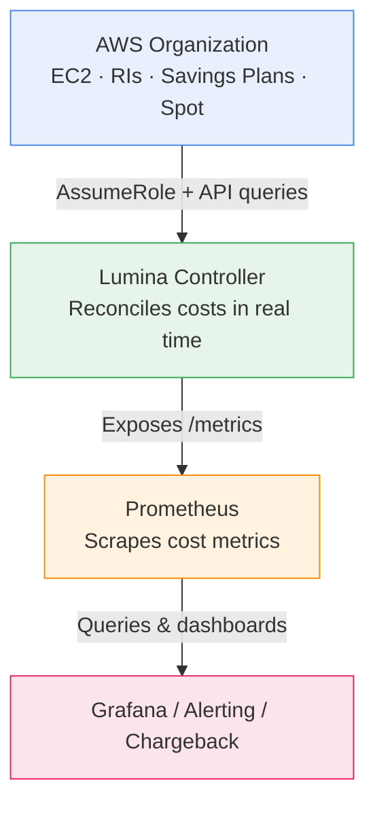

Lumina is a Kubernetes controller that provides real-time cost visibility for EC2 instances by tracking AWS Savings Plans, Reserved Instances, and spot pricing across your entire AWS organization.

## Getting Started

Install Lumina in your cluster and start tracking costs. The [Installation Guide]() covers prerequisites, Helm setup, IAM configuration, and verification steps.

## Concepts

Understand how Lumina works under the hood:

- [Architecture]() -- Data flow, reconciliation loops, caching layers, and the rate-based cost model
- [Cost Calculation]() -- Priority order for discounts, RI/SP allocation algorithms, and known limitations

## Reference

Detailed reference documentation for day-to-day operations:

- [Configuration]() -- All config options, environment variables, and defaults
- [Metrics]() -- Full Prometheus metrics catalog with PromQL examples
- [Helm Chart]() -- Helm values reference
- [Debug Endpoints]() -- HTTP debug API for inspecting cache state

## Operations

- [Troubleshooting]() -- Common issues, symptoms, and debugging steps
- [Development]() -- Local setup, testing, and contributing
