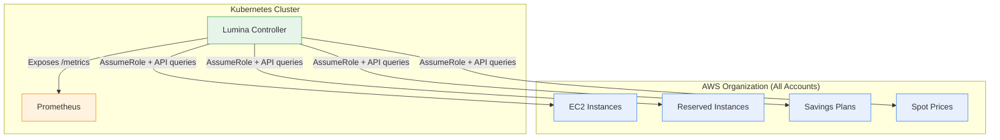
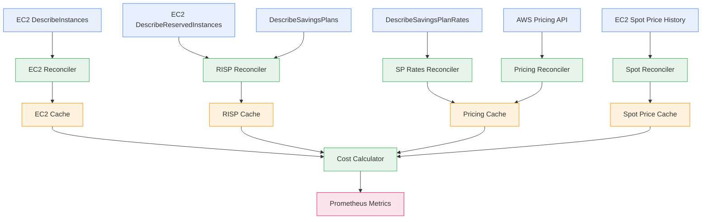
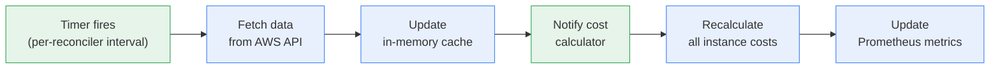

## Overview

Lumina runs as a Kubernetes controller in each cluster and performs the following:

1. **Discovers** all AWS Savings Plans and Reserved Instances across your organization
2. **Tracks** all EC2 instances in real-time (5-minute refresh)
3. **Correlates** EC2 instances with Kubernetes nodes via provider ID
4. **Calculates** effective costs per instance using AWS's Savings Plans allocation algorithm
5. **Exposes** Prometheus metrics for monitoring and alerting



## Rate-Based Model

Lumina uses an **instantaneous rate-based model** (dollars per hour snapshot) rather than cumulative tracking within each billing hour like AWS billing does. This means Lumina's costs are estimates based on "if current instances keep running."

Key concepts:

- **ShelfPrice**: On-demand rate with no discounts (e.g., $1.00/hr for m5.xlarge)
- **EffectiveCost**: Actual estimated cost after all discounts (e.g., $0.34/hr with SP)

### Data Flow



## Reconciliation Loops

Lumina uses multiple reconciliation loops running at different intervals, each responsible for a different data source:

| Reconciler | Default Interval | Data Source | Notes |
|-----------|-----------------|-------------|-------|
| **Pricing** | 24h | AWS Pricing API | On-demand prices change monthly |
| **RISP** | 1h | EC2 + Savings Plans APIs | RI/SP data changes infrequently |
| **EC2** | 5m | EC2 DescribeInstances | Instances change frequently (autoscaling) |
| **SP Rates** | 1-2m | DescribeSavingsPlanRates | Incremental; only fetches missing rates |
| **Spot Pricing** | 15s | EC2 Spot Price History | Fast checks OK due to lazy-loading |
| **Cost** | Event-driven | Internal calculation | Triggered by cache updates |



## Caching Architecture

Lumina maintains several in-memory caches that are populated by the reconciliation loops:

### EC2 Cache
Stores all running EC2 instances across all configured accounts and regions. Updated every 5 minutes.

### RISP Cache
Stores Reserved Instances and Savings Plans. Updated hourly.

### Pricing Cache (Two-Tier)

Lumina uses a two-tier pricing system for Savings Plans rates:

**Tier 1 -- Actual SP Rates from AWS API (Preferred)**

The SP Rates Reconciler fetches real Savings Plan rates using the AWS `DescribeSavingsPlanRates` API. These are the exact purchase-time rates locked in when each SP was bought. Rates are cached using keys like:

```
spArn,instanceType,region,tenancy,os
```

Features:
- Per-SP rates (different SPs can have different rates)
- Tenancy-aware (default vs dedicated)
- OS-aware (Linux vs Windows)
- Incremental updates (only fetches missing rates)
- Sentinel values (-1.0) mark non-existent rate combinations

When Tier 1 rates are used, metrics show `pricing_accuracy="accurate"`.

**Tier 2 -- Discount Multiplier Fallback**

If a rate is not cached (new instance type, cache warming), Lumina falls back to configured discount multipliers (default: 0.72 for 28% discount). When Tier 2 is used, metrics show `pricing_accuracy="estimated"`.

### Spot Price Cache
Stores real-time spot market rates. Uses lazy-loading -- only fetches prices for instance types that are actually running. Automatically refreshes stale prices.

## Multi-Account Support

Lumina uses AWS `AssumeRole` to access multiple AWS accounts from a single controller deployment. Each configured account gets its own IAM role that Lumina assumes to query EC2, Savings Plans, and pricing APIs.

## Multi-Cluster Deployments

When deploying Lumina to multiple clusters that report to a shared Prometheus endpoint, configure them to prevent metric duplication:

- **Management cluster**: Emits all metrics (default)
- **Worker clusters**: Set `metrics.disableInstanceMetrics: true` to emit only aggregate metrics

This is necessary because each Lumina instance discovers all EC2 instances across configured AWS accounts, not just instances in its own cluster.

## Kubernetes Node Correlation

Lumina correlates EC2 instances with Kubernetes nodes using the provider ID on the Node object. This enables the `node_name` label on cost metrics, allowing per-node cost tracking for chargeback and cost allocation.

The `node_name` label uses a fallback chain: Kubernetes node correlation, then EC2 Name tag, then empty string.
